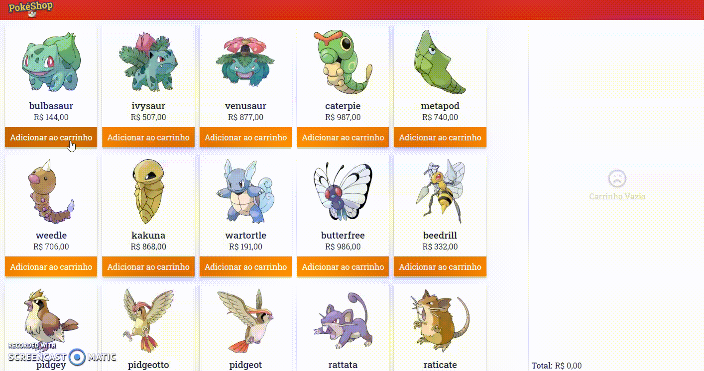

## PokéMart

* Uma pequena aplicação com as funcionalidades: 
  * Listar pokémons
  * Adicionar itens ao carrinho 
  * Finalizar compra
  
* Essa aplicação utiliza a api https://pokeapi.co/ para listagem dos pokemons.

* Tecnologiar Utilizadas:
  * ReactJs
  * Typescript
  * Axios
  * Styled-Components

Para começar a utilizar o projeto apenas baixe ou clone e dê **yarn**

Aplicação disponível em: https://eager-williams-c77bfd.netlify.app/

